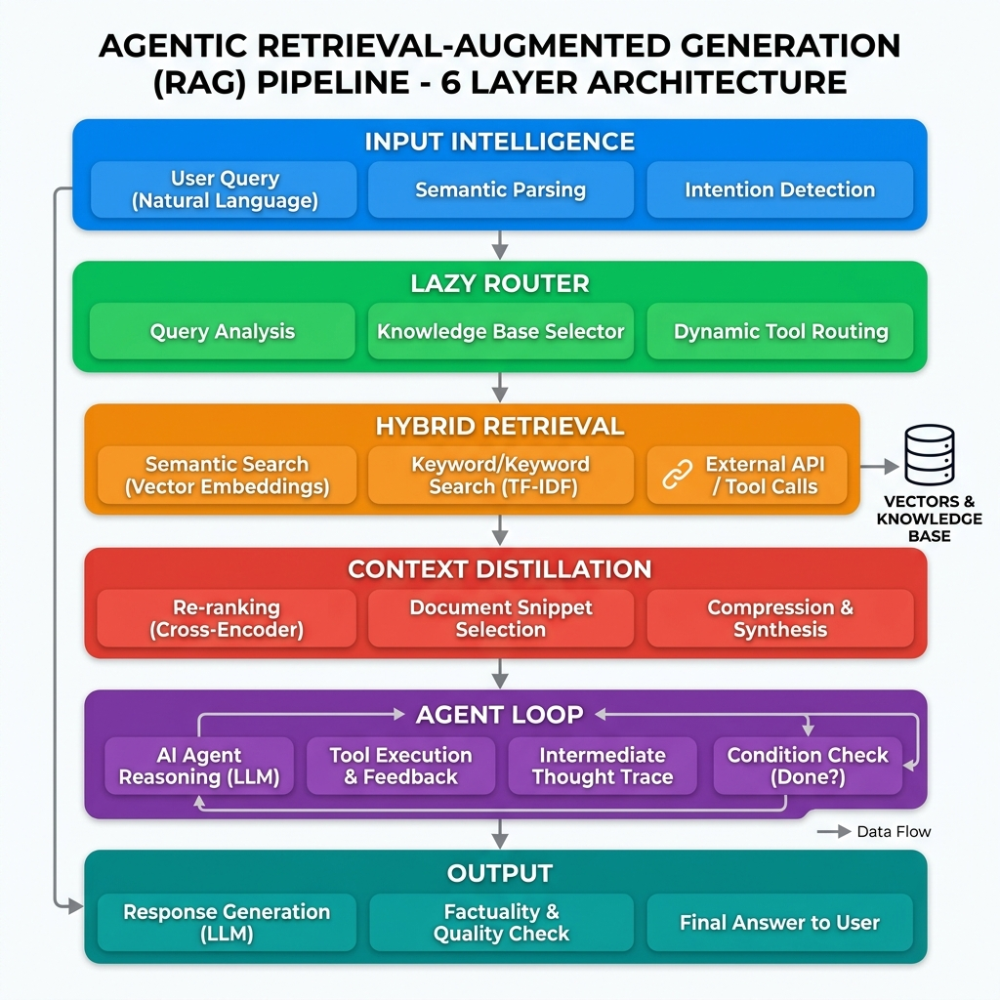

# 6-Layer Agentic RAG Pipeline

A production-grade Retrieval-Augmented Generation system built with LangGraph that goes beyond naive retrieve-and-generate. The pipeline processes every query through six sequential layers — input intelligence, lazy routing, hybrid retrieval, context distillation, agentic critique, and grounded output — producing answers that are cited, verified, and honest about what they do not know.

---

## Architecture Overview

<p align="center">
  
</p>

---

## What Makes This Different

### 1. The system knows when to say "I don't know"

Most RAG systems will fabricate an answer when the retrieved context is insufficient. This pipeline explicitly abstains. The agent loop runs three checks before any answer is generated:

- **Sufficiency**: Does the context contain enough information to fully answer the query?
- **Relevance**: Is the retrieved context actually on-topic?
- **Conflict detection**: Do the retrieved chunks contradict each other?

If any check fails, the system retries retrieval up to two times with adjusted parameters. If it still cannot satisfy the checks, it returns an explicit abstention message instead of hallucinating. This single behavior — refusing to answer rather than guessing — is the primary differentiator against conventional RAG implementations.

### 2. Queries are understood before they are retrieved

Layer 1 rewrites the user query using HyDE (Hypothetical Document Embeddings), generating a synthetic passage that represents what an ideal answer would look like. This synthetic passage is used as the retrieval query, dramatically improving recall for complex or ambiguous questions. Complex queries are also decomposed into sub-questions, each retrieved independently and then merged.

### 3. Not every query hits the vector store

The lazy router (Layer 2) examines the conversation history and decides whether retrieval is necessary at all. Simple follow-up questions like "can you elaborate on that?" skip retrieval entirely and go straight to generation using existing context. This reduces latency and avoids polluting the context with irrelevant chunks on conversational turns.

### 4. Retrieval is hybrid, not single-signal

Layer 3 combines dense semantic search (via configurable embedding models) with BM25 sparse keyword matching. Results from both are merged using Reciprocal Rank Fusion, then a cross-encoder reranker (default: `BAAI/bge-reranker-v2-m3`) scores each candidate for final selection. This catches documents that semantic search misses due to vocabulary mismatch and vice versa.

### 5. Context is distilled, not dumped

Before the retrieved chunks reach the LLM, Layer 4 compresses them down to only the portions that directly address the query. This removes boilerplate, tangential information, and noise. The result is a higher signal-to-noise ratio in the generation prompt, which reduces token cost and improves answer precision.

### 6. Quality is measured, not assumed

Every answer runs through Ragas post-evaluation, measuring faithfulness, answer relevancy, and context precision. These scores are tracked per query, giving you a quantitative view of system performance over time rather than relying on subjective assessment.

---

## Model Control Plane (MCP)

The system abstracts all LLM and embedding calls behind a provider-agnostic interface. You can switch between providers at runtime without changing any pipeline code.

**Supported providers:**

| Provider | LLM Models | Embedding Models |
|----------|-----------|-----------------|
| OpenAI   | gpt-4o, gpt-4o-mini, gpt-4-turbo, gpt-3.5-turbo | text-embedding-3-small, text-embedding-3-large |
| Gemini   | gemini-2.0-flash, gemini-2.0-flash-lite, gemini-1.5-pro | text-embedding-004 |
| Ollama   | llama3.1, llama3.2, qwen2.5, mistral, phi3, gemma2 | Qwen3-Embedding-0.6B, nomic-embed-text, mxbai-embed-large |

To add a new provider, implement the `ModelProvider` abstract class in `mcp/base.py` and register it in `mcp/registry.py`. The interface requires two methods: `get_chat_model()` and `get_embeddings()`.

---

## Project Structure

```
.
├── main.py                    # CLI entry point: ingest + interactive query loop
├── app.py                     # Streamlit web UI
├── api_server.py              # FastAPI REST server
├── config.py                  # Central settings (env-based, Pydantic)
│
├── mcp/                       # Model Control Plane
│   ├── base.py                # Abstract ModelProvider + convenience factories
│   ├── registry.py            # Provider registry (singleton)
│   ├── openai_provider.py     # OpenAI provider implementation
│   ├── gemini_provider.py     # Google Gemini provider implementation
│   └── ollama_provider.py     # Ollama (local) provider implementation
│
├── pipeline/                  # The 6-layer pipeline
│   ├── state.py               # PipelineState — shared state for all nodes
│   ├── input_intelligence.py  # Layer 1: HyDE rewriting + decomposition
│   ├── lazy_router.py         # Layer 2: skip retrieval for follow-ups
│   ├── hybrid_retrieval.py    # Layer 3: dense + BM25 + RRF + reranker
│   ├── context_distillation.py# Layer 4: compress context to signal
│   ├── agent_loop.py          # Layer 5: critique (3 checks) + generation
│   ├── output.py              # Layer 6: format final output
│   └── graph.py               # LangGraph StateGraph wiring
│
├── indexing/                   # Document processing
│   ├── chunker.py             # Recursive text splitting
│   ├── embedder.py            # Embedding wrapper
│   └── store.py               # ChromaDB vector store + BM25 index
│
├── evaluation/
│   └── ragas_eval.py          # Ragas post-evaluation metrics
│
├── data/                      # Place your documents here (PDF, TXT, MD, DOCX)
├── pyproject.toml
└── requirements.txt
```

---

## Setup

### Prerequisites

- Python 3.10 or higher
- At least one LLM provider configured (OpenAI API key, Google API key, or a running Ollama instance)

### Installation

```bash
# Clone the repository
git clone <repo-url>
cd hackathon

# Install dependencies
pip install -r requirements.txt

# Or using pyproject.toml
pip install -e .
```

### Configuration

Create a `.env` file in the project root:

```env
# Required: at least one provider
OPENAI_API_KEY=sk-...
GOOGLE_API_KEY=AI...

# Optional: Ollama runs locally, no key needed
OLLAMA_BASE_URL=http://localhost:11434

# Defaults (override as needed)
DEFAULT_LLM_PROVIDER=openai
DEFAULT_EMBEDDING_PROVIDER=openai
```

All settings can also be overridden through environment variables. See `config.py` for the full list of configurable parameters including retrieval top-k values, reranker model selection, ChromaDB persistence directory, and agent loop retry limits.

---

## Usage

### 1. CLI (Interactive)

```bash
python main.py --data-dir ./data
```

Options:
- `--data-dir`, `-d` : Directory containing documents to index (default: `./data`)
- `--provider` : Override LLM provider (`openai`, `gemini`, or `ollama`)
- `--reindex` : Force re-indexing of documents
- `--no-ragas` : Disable Ragas post-evaluation

Commands inside the interactive loop:
- `/quit` : Exit
- `/clear` : Clear conversation history
- `/providers` : List available model providers

### 2. Web UI (Streamlit)

```bash
streamlit run app.py
```

The web interface provides a sidebar for configuring all pipeline parameters at runtime — provider, model selection, embedding model, reranker, chunk size, retrieval top-k, and whether Ragas evaluation is enabled. Changes take effect immediately.

### 3. REST API (FastAPI)

```bash
uvicorn api_server:app --reload
```

---

## How the Pipeline Processes a Query

1. **Input Intelligence** — The raw query is rewritten using HyDE to produce a synthetic passage optimized for embedding similarity. If the query is complex (multi-part or comparative), it is decomposed into independent sub-questions.

2. **Lazy Router** — The LLM examines the current query against conversation history. If the query is a simple follow-up that can be answered from prior context, retrieval is skipped entirely.

3. **Hybrid Retrieval** — Dense retrieval (embedding similarity via ChromaDB) and sparse retrieval (BM25 keyword matching) run in parallel. Their results are merged using Reciprocal Rank Fusion, then scored by a cross-encoder reranker. The top-k results proceed.

4. **Context Distillation** — Each retrieved chunk is compressed to retain only the portions directly relevant to the query. Irrelevant sentences and boilerplate are removed.

5. **Agent Loop** — The critique node runs three independent checks on the distilled context: sufficiency, relevance, and conflict detection. If any check fails, the pipeline loops back to retrieval with incremented retry count. After two failed retries, the system marks the query for abstention.

6. **Output** — The LLM generates an answer grounded in the distilled context with inline citations. If the query was marked for abstention, a refusal message is returned instead. Ragas metrics (faithfulness, answer relevancy, context precision) are computed and attached to the response.

---

## Adding Documents

Place PDF, TXT, Markdown, or DOCX files in the `data/` directory (or whichever directory you specify with `--data-dir`). On first run, documents are automatically chunked and indexed into ChromaDB. Use `--reindex` to rebuild the index after adding new documents.

---
